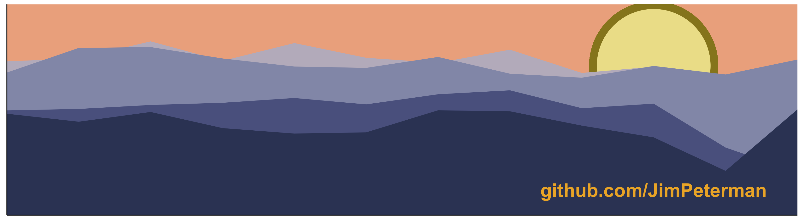
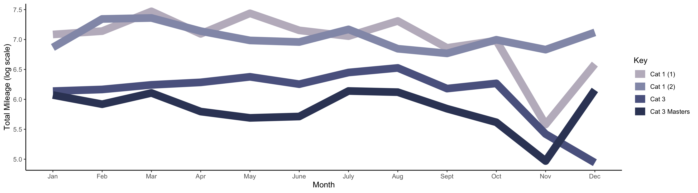

# Creating a LinkedIn Banner Image

I wanted to create an image for the banner of my [LinkedIn profile](www.linkedin.com/in/james-peterman) that illustrated my professional and personal interests. So, using R with some data from athletes I coach, I created a graph that resembles mountain ranges near sunset (thus illustrating my interest in data science as well as the outdoors).

I began by collecting the monthly mileage and time spent on the bike for the past 12 months from 5 different riders with a range of ability levels. Time spent on the bike created some great jagged peaks but I wanted to end up with a slightly different type of image for my banner. So, I used monthly mileage as the variable of interest (and converted the mileage to a log scale so that there was a more compact image). Next, I used one of the [incredible national parks color palettes](https://github.com/kevinsblake/NatParksPalettes) to create the depth in the mountains and then added a sun to finish things off:

For those that are interested, I also plotted the rider data in an easier to interpret format:

As expected, the elite riders ("Cat 1 (1)" and "Cat 1 (2)") both have higher mileage. The "Masters" rider has the lowest mileage and this is mostly due to their limited time availability. It's also clear that November is recovery focused for most riders with time off the bike leading to much lower monthly mileages. 

